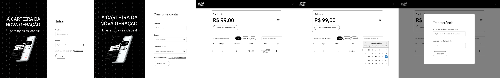
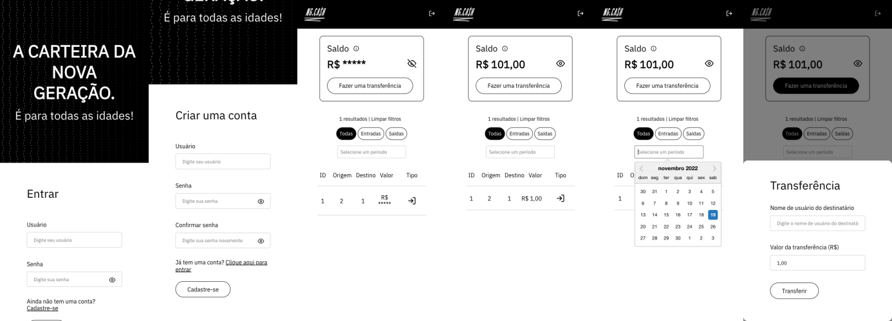

# Processo Seletivo NG <> TRYBE

Aplicante: João Victor Sawada [[E-mail](mailto:joaovictorsawada@gmail.com)] [[Github](https://github.com/nyvemm)]

## Sobre o projeto

Fiz uma aplicação web fullstack dockerizado assim como se pedia no [desafio](https://ngcash.notion.site/Processo-Seletivo-NG-TRYBE-223de32e1ed047f2aa90cc0da84754ee). Tanto a parte de backend quanto a de frontend estão em repositórios separados, mas ambos estão dockerizados e podem ser executados com um único comando.

### Como rodar o projeto

Para rodar o projeto, basta executar o comando `docker-compose up` na raiz do projeto. Isso irá subir o backend e o frontend em containers um mesmo container docker. Mas se quiser rodar separadamente, basta entrar nas pastas `backend` e `frontend` e ler a documentação de cada uma.

### Acessando a aplicação

A aplicação estará disponível em `localhost:80`, como web server foi utilizado o [nginx](https://www.nginx.com/) para fazer o proxy reverso entre o frontend e o backend. Caso queira acessar a API, ela estará disponível em `localhost:80/api`.

### Rodando no ambiente de testes

Para o desenvolvimento, eu recomendo subir a aplicação pelo docker e então rodar o `frontend` pelo `yarn dev`. Assim, o frontend poderá ter acesso direito a API e não precisará de um proxy reverso.

Caso tenha algum erro de CORS, basta adicionar flags no navegador para desabilitar o CORS. No chrome, por exemplo, basta adicionar a flag `--disable-web-security` e `--user-data-dir` para desabilitar o CORS.

> open -na Google\ Chrome --args --user-data-dir=/tmp/temporary-chrome-profile-dir --disable-web-security --disable-site-isolation-trials

---

### Requisitos

Todos os requisitos especificados no desafio foram implementados tanto no backend quanto no frontend.

### Git

Toda a aplicação está versionada em [Git](https://git-scm.com/), possuindo commits bem descritos e organizados de maneira semântica. Caso queira ver o histórico de commits, basta acessar pelo comando `git log`.

### Testes

Foram implementados testes unitários para o backend e frontend. Para as duas aplicações, os testes foram feitos usando o [jest](https://jestjs.io/). Para rodar os testes, basta executar o comando `jest` na pasta de cada aplicação. Se quiser ver a cobertura dos testes, basta executar o comando `jest --coverage` na pasta de cada aplicação.

### Responsividade

A aplicação do frontend é responsiva, podendo ser acessada tanto em desktop quanto em mobile.

### Documentação adicional

- [Backend](./backend/README.md)
- [Frontend](./frontend/README.md)

---

## Screenshots

### Desktop

### Mobile

