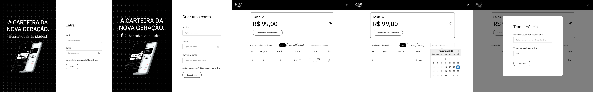
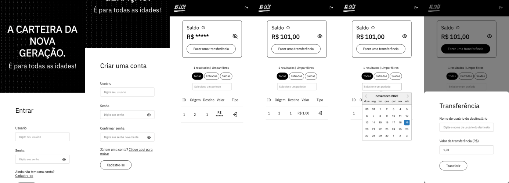

# NG <> TRYBE Selection Process

Applicant: João Victor Sawada [[E-mail](mailto:joaovictorsawada@gmail.com)] [[GitHub](https://github.com/nyvemm)]

## About this project

I built a dockerized full-stack web application as requested in the [challenge](https://ngcash.notion.site/Processo-Seletivo-NG-TRYBE-223de32e1ed047f2aa90cc0da84754ee). Both the backend and the frontend are in separate repositories, but both are dockerized and can be started with a single command.

### How to run the project

To run the project, execute `docker-compose up` in the project root. This will start the backend and the frontend in containers. If you prefer to run them separately, go into the `backend` and `frontend` folders and follow the documentation in each.

### Accessing the application

The application is available at `localhost:80`. Nginx is used as the web server and reverse proxy between the frontend and the backend. If you want to access the API directly, it is available at `localhost:80/api`.

### Running in a development environment

For development, I recommend starting the app with Docker and then running the `frontend` with `yarn dev`. This allows the frontend to access the API directly without requiring a reverse proxy.

If you encounter CORS issues during development, you can add flags to your browser to disable web security. For Chrome, for example, add the flags `--disable-web-security` and `--user-data-dir` to start it without CORS restrictions.

> open -na Google\ Chrome --args --user-data-dir=/tmp/temporary-chrome-profile-dir --disable-web-security --disable-site-isolation-trials

---

### Requirements

All requirements specified in the challenge have been implemented in both the backend and the frontend.

### Git

The whole project is versioned with [Git](https://git-scm.com/) and uses descriptive, semantic commits. To view the commit history, run `git log`.

### Tests

Unit tests are implemented for both backend and frontend using [Jest](https://jestjs.io/). To run the tests, execute `jest` inside each application folder. To view coverage, run `jest --coverage`.

### Responsiveness

The frontend is responsive and works on both desktop and mobile devices.

### Additional documentation

- [Backend](./backend/README.md)
- [Frontend](./frontend/README.md)

---

## Screenshots

### Desktop

### Mobile

